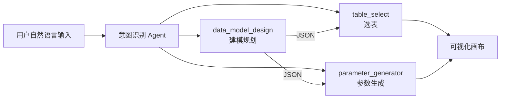

这是一张**智能建模 / Data Agent 的后端 Agent 编排流程图**，描述的是：用户输入进来后，系统如何先做意图识别，再路由到不同 Agent 完成建模相关任务。

---

## 一、整体架构：先识别意图，再分发 Agent

流程从 **「开始」** 进入，核心是 **「意图识别 Agent」**：

1. 判断用户想做什么
2. 选择对应的大模型
3. 路由到 6 类专用 Agent 之一

可以把它理解成：**一个总调度器 + 六个专业子 Agent**。

| Agent | 中文含义 | 主要职责 |
|-------|----------|----------|
| `data_model_design` | 数据模型设计 | 生成建模方案、指标/维度/SQL 规划 |
| `table_select` | 选表 | 从元数据中匹配可用数据表 |
| `parameter_generator` | 参数生成 | 为 ETL 算子节点生成配置参数 |
| `model_qa` | 模型问答 | 回答与模型、表、节点相关的问题 |
| `model_node_explain` | 节点解释 | 解释某个节点/字段的含义 |
| `question_answer` | 通用问答 | 处理非建模类的普通问题 |

---

## 二、主链路：建模规划 → 选表 → 参数生成

和你测试里遇到的「选表 → 规划 → 算子参数」主流程，基本对应下面三条链路。

### 1. `data_model_design`（最左侧，最复杂）

这是**建模规划 Agent**，负责把自然语言需求转成结构化方案。

大致步骤：

1. 判断用户是否在问某个**指标/维度**
2. 查维度表、指标表等元数据
3. 结合 Prompt + 大模型，判断信息是否足够生成 SQL
4. 按业务逻辑找对应表，生成建模方案
5. 输出结构化结果（JSON），供后续 Agent 使用
6. 若信息不足，会提示用户补充

**对应你测试中的问题：**
- 「手动选表后无建模规划」→ 这条链路中断
- 「复合指标无法解决」→ 很可能卡在这里的指标/维度识别或 SQL 生成逻辑
- 「筛选逻辑太简单」→ 方案生成质量不足

### 2. `table_select`（第二列）

这是**选表 Agent**，负责从元数据里找最匹配的表。

大致步骤：

1. 从上游 JSON 中取出表名
2. 映射到逻辑模型 / 物理表
3. 用 `role_id` 做权限过滤
4. 返回 Top 3 匹配表

**对应你测试中的问题：**
- 「推荐表不准确」→ 匹配算法或语义理解有问题
- 「手动添加表报错：未筛选到业务匹配的表」→ 手动选表与自动筛选逻辑冲突
- 「多表只能二选一」→ 表类型/意图分组规则不合理
- 「@ 引用表解析失败」→ 表名实体识别失败

### 3. `parameter_generator`（中间列）

这是**算子参数生成 Agent**，负责把规划方案落成可执行节点。

大致步骤：

1. 从 JSON 中取出 `etl_add_node` 参数
2. 按 `node_type` 分支（如汉化字段、数据过滤、SQL 等）
3. 结合 Prompt、算子列表、用户输入生成参数
4. 输出节点列表、类型、逻辑配置

**对应你测试中的问题：**
- 「多次重试仍无法生成符合算子结构的参数」→ 直接对应这条链路
- 这是你文档里 **OPT-003（P0）** 的根因所在

---

## 三、辅助链路：问答与解释

### 4. `model_qa`（模型问答）

处理与模型、表、节点相关的问题，分两类：

- **`out_qa`**：基于已有算子配置回答
- **`table_qa`**：在表元数据中做相似度检索，再解释表结构和用途

### 5. `model_node_explain`（节点解释）

基于当前节点配置 + Prompt，解释某个节点在做什么，对应产品里的「智能注释」能力。

### 6. `question_answer`（通用问答）

兜底处理不属于以上几类的普通问题。

---

## 四、几个关键技术特征

1. **JSON 作为 Agent 间的中转格式**  
   上游 Agent 输出 JSON，下游 Agent 再解析执行，所以任一环节 JSON 结构不对，整条链路都会断。

2. **Prompt + 大模型驱动**  
   图中多处「提示词」「大模型选择」，说明核心决策依赖 LLM，效果受 Prompt 和上下文质量影响大。

3. **元数据强依赖**  
   选表、指标/维度识别、表问答都依赖元数据服务；元数据不全或权限有问题，会直接报错。

4. **权限控制**  
   `table_select` 中有 `role_id` 过滤，和用户域报错、数据域/用户域表现不一致可能有关。

5. **失败可回退**  
   找不到表或信息不足时，会提示用户补充，而不是直接失败。

---

## 五、和你这段时间工作的对应关系

| 你测到的问题 | 可能出在哪个 Agent |
|-------------|-------------------|
| 推荐表不准、多表只能二选一 | `table_select` |
| 无建模规划、复合指标失败 | `data_model_design` |
| 算子参数生成失败 | `parameter_generator` |
| @ 引用解析失败 | 意图识别 + `table_select` |
| 用户域报错 | 网关层 / 权限 / 元数据服务 |
| 派生指标不准 | `data_model_design` + `parameter_generator` |

---

## 六、一句话总结

这张图描述的是：**智能建模助手背后并不是一个大模型包办全部，而是「意图识别 → 多 Agent 分工协作 → JSON 串联 → 元数据 + Prompt + LLM 驱动」的编排架构。**

你这段时间测到的 P0 问题，基本都集中在 **`table_select` → `data_model_design` → `parameter_generator`** 这条主链路上；文档、白皮书、操作手册写的，是这条链路面向用户的产品能力；优化记录里的 12 条 OPT，则是这条链路各环节的缺陷清单。

如果你需要，我可以再帮你把这张图**对照《产品优化记录》12 条 OPT 做一版「问题 → Agent → 修复建议」映射表**，方便写进实习总结或汇报材料。